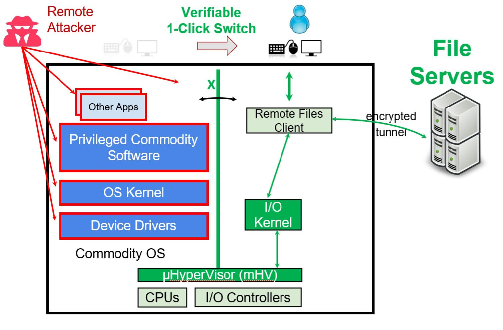

# [Tech] How to Make Micro-Hypervisors Compatible with Commodity OSes

Micro-hypervisors (mHVs) isolate security-sensitive applications (SecApps) from commodity OSes (e.g., Win10, Win11, Linux), which are large and complex and hence are inevitably vulnerable. mHVs create a red partition to run a commodity OS and one or more green partitions to run SecApps. The red partition owns most of the computer resources (e.g., memory, I/O devices) to run general-purpose OSes and applications, whereas the green partitions own only the necessary resources to run SecApps.

   
   
 mHVs Isolate Green Partitions From the Red Partition. (Figure from "GreenBox Protection") 

mHVs are much simpler than general-purpose hypervisors. mHVs' main goal is to isolate green partition(s) from the red partition. Thus, mHVs do not need to implement the resource virtualization, consolidation, management, and migration functions required in general hypervisors. For this reason, the code size of mHVs is on the order of 10K to 100K SLoC, not 1B SLoC for general hypervisors (which require full-fledged host OSes).

mHVs change the computer boot procedure a little bit, mostly transparently to users. When a computer powers up, it boots an mHV first; then, the mHV initializes and boots a feature-rich commodity OS in the red partition. When users need to run a SecApp, the mHV creates a green partition and runs it.

## Challenge: Making Micro-Hypervisors Compatible with Commodity OSes

To keep commodity OSes alive, mHVs must support the *minimal* bare-metal micro-architecture functions that are required by OSes. mHVs should not support *all* bare-metal functions (i.e., native micro-architecture functions), or mHVs become complex with reduced assurance. mHVs should not support *only* emulated micro-architectures either (e.g., ones provided by QEMU or VMware Workstation), because they provide fewer functions than real machines, and some are obsolete; e.g., Intel Core Ultra (Series 2 (maybe 1?)) uses Gen 6 and above IOMMUs, whereas VMware provides older IOMMUs with reduced functions.

In the GreenBox development to date, I have identified three issues causing OS incompatibility:

1. **OSes issue faulting MSR reads and writes (a.k.a. "unsafe" in Linux).** Linux issues faulting MSR (Model Specific Register) reads/writes to detect available MSRs. These MSR accesses cause x86 #GP exceptions. Thus, mHVs must issue these accesses in MSR access trap handlers, catch the #GP exceptions, and inject exceptions into commodity OSes.
2. **OSes use legacy functions.** For example, OSes rely on Memory Typing (write-back, write-through, write-combine, uncached) recorded in MTRRs and SMRRs. On Intel CPUs, MTRRs and SMRRs do not take effect for commodity OSes running in guest partitions. EPTs control their memory typing instead. Thus, mHVs must read the memory typing recorded in MTRRs and SMRRs and set it in EPTs.
3. **OSes may not follow the specs of micro-architecture functions.** x86 CPU specs require the Bootstrap Processor (BSP) to wait for 10 ms after sending an INIT signal in the INIT-SIPI-SIPI sequence. However, Linux does not wait. Thus, mHVs may still be handling the INIT signal for Application Processors (APs) when the BSP issues SIPI interrupts and hence fail to deliver SIPIs to the APs. mHVs must add this delay in the INIT VMEXIT handler to ensure correct timing.
